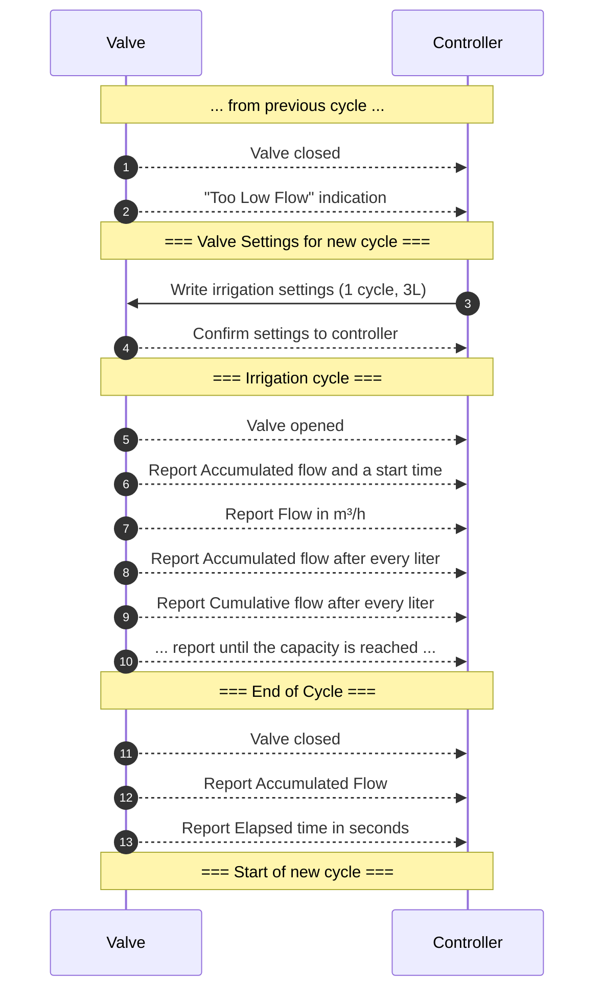

# Sonoff Smart Valve - Event Timeline Analysis

This document provides a detailed analysis of the event timeline for the Sonoff Smart Valve, focusing on both quantitative and timed irrigation cycles. The analysis is based on packet captures, highlighting key events and their corresponding attributes.

## Key Workflow Insights

This section summarizes the most important findings and attribute behaviors observed during the analysis. It provides a high-level overview of how the valve operates, how configuration attributes are structured, and what to expect from key attributes during different irrigation modes. Reviewing this section first will help you understand the main patterns before diving into the detailed event timelines and tables.

1. **Attribute Behavior at Low Flow**:

   - During very low or zero flow conditions, attributes such as `0x500f`, `0x5006`, and `0x5008` may not increment or report as consistently as they do during high flow. This is likely due to internal logic or sensor thresholds in the valve firmware. For example, `0x500f` may increment more slowly or stall, and `0x5006` may not reflect elapsed time as precisely. This should be considered when analyzing or troubleshooting irregular irrigation events.

2. **Structure of Timed or Quantitative Configuration Attributes**

   The attributes `0x5008` and `0x5009` are used to configure the irrigation cycles, with `0x5008` for timed irrigation and `0x5009` for quantitative irrigation. The structure of these attributes is consistent across different flow rates, but the values change based on the configuration set by the user.

   #### Byte Map for 0x5008 (Timed Irrigation)

   ```markdown
   | Byte    | 0    | 1    | 2      | 3    | 4-6            | 7    | 8-10           |
   | ------- | ---- | ---- | ------ | ---- | -------------- | ---- | -------------- |
   | Desc    | Len  | Ctrl | Cycles | N/A  | Duration (s)   | N/A  | Interval (s)   |
   | Example | 0x0a | 0x00 | 0x08   | 0x00 | 0x00 0x00 0x07 | 0x00 | 0x00 0x00 0x06 |
   ```

   **Detailed Structure:**

   - **Byte 0:** Length of the data field (0x0a)
   - **Byte 1:** Control flag (0x00 or 0x01)
   - **Byte 2:** Total irrigation cycles
   - **Byte 3:** Not in use
   - **Bytes 4-6:** Single irrigation duration (in seconds)
   - **Byte 7:** Not in use
   - **Bytes 8-10:** Time interval between two adjacent irrigations (in seconds)

   #### Byte Map for 0x5009 (Quantitative Irrigation)

   ```markdown
   | Byte    | 0    | 1    | 2      | 3    | 4-6            | 7    | 8-10           |
   | ------- | ---- | ---- | ------ | ---- | -------------- | ---- | -------------- |
   | Desc    | Len  | Ctrl | Cycles | N/A  | Volume (L)     | N/A  | Interval (s)   |
   | Example | 0x0a | 0x00 | 0x64   | 0x00 | 0x00 0x19 0x64 | 0x00 | 0x01 0x51 0x80 |
   ```

   **Detailed Structure:**

   - **Byte 0:** Length of the data field (0x0a)
   - **Byte 1:** Control flag (0x00 or 0x01)
   - **Byte 2:** Total irrigation cycles
   - **Byte 3:** Not in use
   - **Bytes 4-6:** Single irrigation volume (in liters)
   - **Byte 7:** Not in use
   - **Bytes 8-10:** Time interval between two adjacent irrigations (in seconds)

3. **Attributes in Detail**

   This section describes the main attributes and their roles in both quantitative and timed irrigation modes. Understanding these will help you interpret the event tables and packet captures.

   - **`0x0000` – Valve Status:** Indicates the current state of the valve, where **`1`** means open and **`0`** means closed. Critical for managing irrigation cycles.
   - **`0x5006` – Cycle Volume Counter / Cycle Length:** In quantitative mode, increments with each cycle to show dispensed volume. In timed mode, only provides the duration at cycle end.
   - **`0x5007` – Accumulated Water Volume:** Tracks total water dispensed in quantitative mode. In timed mode, its meaning is unclear and may require further investigation.
   - **`0x5008` / `0x5009` – Configuration Strings:** Written to the valve to set up new irrigation schedules. `0x5008` is for timed, `0x5009` for quantitative. They act as configuration commands and state echoes.
   - **`0x500d` / `0x500e` – Start/End Time:** Unix timestamps for the start and end of each irrigation cycle.
   - **`0x500f` – Cumulative Flow Counter:** Increments steadily during irrigation, tracking total flow over time.

---

## The overall timeline is structured to reflect the sequence of events during the irrigation cycles, including valve operations, flow measurements, and system responses.

---

_Summary: The above section provides a concise overview of the most important workflow patterns, attribute structures, and their meanings. Refer to this before analyzing the detailed event timelines below._

---

### Event Timeline for Quantitative Irrigation

_Summary: This section presents a step-by-step timeline of a typical quantitative irrigation cycle, showing how the valve and controller interact, and which attributes are reported at each stage. Use this as a reference for understanding the sequence of events and expected attribute changes during a quantitative cycle._



## Detailed Event Timelines from Wireshark Captures

### Event Timeline for Quantitative Irrigation (Mapped to Packet Captures)

_Summary: The following table maps each event in a quantitative irrigation cycle to its corresponding packet capture frame, attribute, and any critical observations. This helps verify that the system operates as expected and provides a reference for troubleshooting or further analysis._

Wireshark captures show the following sequence of events for a quantitative irrigation cycle, confirming the system's operation as per the defined attributes:

| Frame | Attribute | Event                                    | Critical Observations                                   |
| ----- | --------- | ---------------------------------------- | ------------------------------------------------------- |
| 1407  | `0x0000`  | Valve closed (previous cycle)            |                                                         |
| 1409  | `0x500e`  | End time: 2025-07-12 19:36:27            |                                                         |
| 1412  |           | Valve reports: Too low Flow              | Indication of successful closed state?                  |
| 1469  | `0x5009`  | **Write to valve**: 1 cycle, 3L capacity | Matches CSV structure                                   |
|       |           |                                          | {0xa, 0x0, 0x1, 0x0, 0x0, 0x0, 0x3, 0x0, 0x0, 0x0, 0x1} |
| 1475  | `0x5008`  | Valve reports empty string:              | {0xa, 0x0, 0x0, 0x0, 0x0, 0x0, 0x0, 0x0, 0x0, 0x0, 0x0} |
| 1477  | `0x5009`  | Valve reports: 1 cycle, 3L capacity      | Matches CSV structure                                   |
|       |           |                                          | {0xa, 0x1, 0x1, 0x0, 0x0, 0x0, 0x3, 0x0, 0x0, 0x0, 0x1} |
| 1479  | `0x0000`  | **Valve OPENED**                         | Irrigation start trigger                                |
|       |           | Valve reports: 0L accumulated            |                                                         |
| 1481  | `0x500d`  | **Start time**: 2025-07-12 19:36:37      |                                                         |
| 1551  | `0x0000`  | Flow: 0.4 m³/h (4)                       | Current flow                                            |
| 1576  | `0x500f`  | Valve reports accumulated amount 57 l    |                                                         |
| 1592  | `0x5007`  | Valve reports: 1L accumulated            |                                                         |
| 1613  | `0x500f`  | Valve reports accumulated amount 58 l    |                                                         |
| 1629  | `0x5007`  | Valve reports: 2L accumulated            | Matches configured capacity                             |
| 1641  | `0x5006`  | Value=20                                 | Duration of irrigation                                  |
|       | `0x5007`  | Valve reports 2L accumulated flow        |                                                         |
| 1643  | `0x0000`  | **Valve CLOSED**                         | Irrigation stop                                         |
| 1645  | `0x500e`  | **End time**: 2025-07-12 19:36:56        | **Duration: 19 sec**                                    |
| 1648  |           | Valve reports: Too low Flow              | Indication of successful closed state?                  |
| 1738  | `0x5009`  | Write to valve settings for next cycle   | Start of next cycle preparation                         |

### Event Timeline for Timed Irrigation less than 0.1 m³/h (Mapped to Packet Captures)

_Summary: This section details the event sequence for a timed irrigation cycle at very low flow rates, highlighting how the system responds and which attributes are affected. It is useful for understanding system behavior under minimal flow conditions._

Wireshark captures show the following sequence of events for a timed irrigation cycle, confirming the system's operation as per the defined attributes:
Wireshark file name: `20250713_QuantitativeCapture_041115_0.0Flow.pcapng`
Parameters for this capture:

- **Flow Rate**: 0.0 m³/h
- **Number of individual cycles**: 4 times
- **Volume for irrigation as Valve OPEN**: 11 liters
- **Time between cycles**: 15 seconds

| Frame | Attribute | Event                                    | Critical Observations                                   |
| ----- | --------- | ---------------------------------------- | ------------------------------------------------------- |
| 6     | `0x5009`  | **Write to valve**:4 / 11 / 15           | {0xa, 0x0, 0x4, 0x0, 0x0, 0x0, 0xb, 0x0, 0x0, 0x0, 0xf} |
| 12    | `0x5008`  | Valve reports empty string               | {0xa, 0x0, 0x0, 0x0, 0x0, 0x0, 0x0, 0x0, 0x0, 0x0, 0x0} |
| 14    | `0x5009`  | Valve reports as configured              | {0xa, 0x1, 0x4, 0x0, 0x0, 0x0, 0xb, 0x0, 0x0, 0x0, 0xf} |
| 16    | `0x0000`  | **Valve OPENED**                         | Irrigation start trigger                                |
| 26    | `0x5007`  | Valve reports: 0                         |                                                         |
|       | `0x500d`  | **Start time**: 1752389501               | 2025-07-13 04:11:41 UTC                                 |
|       | `0x5010`  | Valve reports: 1                         |                                                         |
| 97    | `0x500c`  | Valve reports: 1                         |                                                         |
| 99    | `0x500c`  | Valve reports: 1                         |                                                         |
| 121   | `0x500c`  | Valve reports: 1                         |                                                         |
| 137   | `0x500c`  | Valve reports: 1                         |                                                         |
| 179   | `0x5006`  | Valve reports: 60 (60 seconds elapsed)   |                                                         |
| 266   | `0x5006`  | Valve reports: 120 (120 seconds elapsed) |                                                         |
| 350   | `0x5006`  | Valve reports: 180 (180 seconds elapsed) |                                                         |

... (continues with similar pattern) ...
Manually closed the valve and data capturing of the irrigation cycle

### Event Timeline for Timed Irrigation 0.6 m³/h (Mapped to Packet Captures)

_Summary: This section shows the event timeline for a timed irrigation cycle at a higher flow rate (0.6 m³/h), allowing comparison with lower flow scenarios and helping to identify any differences in attribute reporting or system response._

Wireshark captures show the following sequence of events for a timed irrigation cycle, confirming the system's operation as per the defined attributes:
Wireshark file name: `20250713_QuantitativeCapture_041115_0.6Flow.pcapng`
Parameters for this capture:

- **Flow Rate**: 0.6 m³/h
- **Number of individual cycles**: 4 times
- **Volume for irrigation as Valve OPEN**: 11 liters
- **Time between cycles**: 15 seconds

| Frame | Attribute | Event                          | Critical Observations                                   |
| ----- | --------- | ------------------------------ | ------------------------------------------------------- |
| 5     | `0x5009`  | **Write to valve**:4 / 11 / 15 | {0xa, 0x0, 0x4, 0x0, 0x0, 0x0, 0xb, 0x0, 0x0, 0x0, 0xf} |
| 13    | `0x5009`  | Valve reports as configured    | {0xa, 0x1, 0x4, 0x0, 0x0, 0x0, 0xb, 0x0, 0x0, 0x0, 0xf} |
| 15    | `0x0000`  | **Valve OPENED**               | Irrigation start trigger                                |
| 17    | `0x5007`  | Valve reports: 0               | 0 liters                                                |
|       | `0x500d`  | **Start time**: 1752425119     | 2025-07-13 05:05:19 UTC                                 |
|       | `0x5010`  | Valve reports: 1               | Normal operation                                        |
| 63    | `0x0000`  | Flow: 0.6 m³/h (1)             | Current flow rate                                       |
| 79    | `0x500f`  | Valve reports: 35              | 35 liters                                               |
| 95    | `0x5007`  | Valve reports: 1               | 1 liter                                                 |
| 115   | `0x500f`  | Valve reports: 36              | 36 liters                                               |
| 132   | `0x5007`  | Valve reports: 2               | 2 liters                                                |
| 150   | `0x500f`  | Valve reports: 37              | 37 liters                                               |
| 166   | `0x5007`  | Valve reports: 3               | 3 liters                                                |
| 184   | `0x500f`  | Valve reports: 38              | 38 liters                                               |
| 200   | `0x5007`  | Valve reports: 4               | 4 liters                                                |
| 220   | `0x500f`  | Valve reports: 39              | 39 liters                                               |
| 236   | `0x5007`  | Valve reports: 5               | 5 liters                                                |
| 254   | `0x500f`  | Valve reports: 40              | 40 liters                                               |
| 270   | `0x5007`  | Valve reports: 6               | 6 liters                                                |
| 288   | `0x500f`  | Valve reports: 41              | 41 liters                                               |
| 304   | `0x5007`  | Valve reports: 7               | 7 liters                                                |
| 323   | `0x500f`  | Valve reports: 42              | 42 liters                                               |
| 341   | `0x5007`  | Valve reports: 8               | 8 liters                                                |
| 357   | `0x500f`  | Valve reports: 43              | 43 liters                                               |
| 378   | `0x5007`  | Valve reports: 9               | 9 liters                                                |
| 395   | `0x500f`  | Valve reports: 44              | 44 liters                                               |
| 411   | `0x5006`  | Valve reports: 60              | 60 liters                                               |
| 427   | `0x5007`  | Valve reports: 10              | 10 liters                                               |
| 443   | `0x500f`  | Valve reports: 45              | 45 liters                                               |
| 462   | `0x5007`  | Valve reports: 11              | 11 liters                                               |
| 474   | `0x5006`  | Valve reports: 68              | 68 liters                                               |
|       | `0x5007`  | Valve reports: 11              | 11 liters                                               |
| 476   | `0x0000`  | **Valve CLOSED**               | Irrigation stop                                         |
| 478   | `0x500e`  | **End time**: 1752425187       | 2025-07-13 05:06:27 UTC                                 |
| 480   |           | Valve reports: Too low Flow    | Indication of successful closed state?                  |
| 537   | `0x5009`  | **Write to valve**:4 / 11 / 15 | {0xa, 0x2, 0x4, 0x0, 0x0, 0x0, 0xb, 0x0, 0x0, 0x0, 0xf} |
| 539   | `0x0000`  | **Valve OPENED**               | Irrigation start trigger                                |
| 541   | `0x5006`  | Valve reports: 0               |                                                         |
|       | `0x5007`  | Valve reports: 0               |                                                         |
|       | `0x500d`  | **Start time**: 1752425202     | 2025-07-13 05:06:42 UTC                                 |
| 575   | `0x0000`  | Flow: 0.6 m³/h (1)             | Current flow rate                                       |
| 577   | `0x500f`  | Valve reports: 46              |                                                         |
| 604   | `0x5007`  | Valve reports: 1               |                                                         |
| 620   | `0x500f`  | Valve reports: 47              |                                                         |
| 639   | `0x5007`  | Valve reports: 2               |                                                         |
| 655   | `0x500f`  | Valve reports: 48              |                                                         |
| 674   | `0x5007`  | Valve reports: 3               |                                                         |
| 690   | `0x500f`  | Valve reports: 49              |                                                         |
| 674   | `0x5007`  | Valve reports: 4               |                                                         |
| .     |           |                                |                                                         |
| .     |           |                                |                                                         |
| .     |           |                                |                                                         |
| 1797  | `0x5007`  | Valve reports: 11              |                                                         |
|       | `0x500f`  | Valve reports: 79              |                                                         |
| 1809  | `0x5006`  | Valve reports: 68              |                                                         |
|       | `0x5007`  | Valve reports: 11              |                                                         |
| 1811  | `0x0000`  | **Valve CLOSED**               | Irrigation stop                                         |
| 1813  | `0x500e`  | **End time**: 1752425431       | 2025-07-13 05:10:31 UTC                                 |
|       | `0x5010`  | Valve reports: 0               |                                                         |
| 2640  | `0x500f`  | Valve reports 79               |                                                         |

### Event Timeline for Timed Irrigation 0.1 m³/h (Mapped to Packet Captures)

_Summary: This section presents the event sequence for a timed irrigation cycle at 0.1 m³/h, with a focus on how the system tracks cycles, timing, and flow at this intermediate rate._

Wireshark captures show the following sequence of events for a timed irrigation cycle, confirming the system's operation as per the CSV-defined parameters:
Wireshark file name: `20250713_TimedCapture_080706_0.1Flow.pcapng`
Parameters for this capture:

- **Flow Rate**: 0.1 m³/h
- **Number of individual cycles**: 8 times
- **Time for irrigation as Valve OPEN**: 7 seconds
- **Time between cycles**: 6 seconds

| Frame | Attribute | Event                         | Critical Observations                                   |
| ----- | --------- | ----------------------------- | ------------------------------------------------------- |
| 14    | `0x5008`  | **Write to valve**: 8 / 7 / 6 | {0xa, 0x0, 0x8, 0x0, 0x0, 0x0, 0x7, 0x0, 0x0, 0x0, 0x6} |
| 20    | `0x5009`  | Valve reports empty string    | {0xa, 0x0, 0x0, 0x0, 0x0, 0x0, 0x0, 0x0, 0x0, 0x0, 0x0} |
| 22    | `0x5008`  | Valve reports as configured   | {0xa, 0x1, 0x8, 0x0, 0x0, 0x0, 0x7, 0x0, 0x0, 0x0, 0x6} |
| 24    | `0x0000`  | **Valve OPENED**              | Irrigation start trigger                                |
| 26    | `0x5007`  | Valve reports: 0              |                                                         |
|       | `0x500d`  | **Start time**: 1752412317    | 2025-07-13 03:31:57 UTC                                 |
|       | `0x5010`  | Valve reports: 0              |                                                         |
| 72    | `0x0000`  | Flow: 0.1 m³/h (1)            | Current flow rate                                       |
| 92    | `0x5006`  | Valve reports: 8              |                                                         |
|       | `0x5007`  | Valve reports: 0              |                                                         |
| 94    | `0x0000`  | **Valve CLOSED**              | Irrigation stop                                         |
| 96    | `0x500e`  | **End time**: 1752412324      | 1752412324 (2025-07-13 03:32:04 UTC)                    |
| 98    |           | Valve reports: Too low Flow   | Indication of successful closed state?                  |
| 147   | `0x5008`  | Valve reports: 8 / 7 and 6    | and second cycle as 0x2                                 |
|       |           |                               | {0xa, 0x2, 0x8, 0x0, 0x0, 0x0, 0x7, 0x0, 0x0, 0x0, 0x6} |
| 149   | `0x0000`  | **Valve OPENED**              | Irrigation start trigger                                |
| 151   | `0x500d`  | **Start time**: 1752412330    | 2025-07-13 03:32:10 UTC                                 |
| 183   | `0x0000`  | Flow: 0.1 m³/h (1)            | Current flow                                            |
| 201   | `0x5006`  | Valve reports: 8              |                                                         |
|       | `0x5007`  | Valve reports: 0              |                                                         |
| 203   | `0x0000`  | **Valve CLOSED**              | Irrigation stop                                         |
| 205   | `0x500e`  | **End time**: 1752412337      | 2025-07-13 03:32:17 UTC                                 |
| 208   |           | Valve reports: Too low Flow   | Indication of successful closed state?                  |
| 259   | `0x5008`  | Valve reports: 8 / 7 and 6    | and third cycle as 0x3                                  |
|       |           |                               | {0xa, 0x3, 0x8, 0x0, 0x0, 0x0, 0x7, 0x0, 0x0, 0x0, 0x6} |
| 261   | `0x0000`  | **Valve OPENED**              | Irrigation start trigger                                |
| 263   | `0x500d`  | **Start time**: 1752412343    | 2025-07-13 03:32:23 UTC                                 |
| 259   | `0x0000`  | Flow: 0.1 m³/h (1)            | Current flow                                            |
| 201   | `0x5006`  | Valve reports: 8              |                                                         |
|       | `0x5007`  | Valve reports: 0              |                                                         |
| .     |           |                               |                                                         |
| .     |           |                               |                                                         |
| .     |           |                               |                                                         |
| 420   | `0x500f`  | Valve reports: 3              |                                                         |
| .     |           |                               |                                                         |
| .     |           |                               |                                                         |
| .     |           |                               |                                                         |
| 769   | `0x500f`  | Valve reports: 4              |                                                         |

### Event Timeline for Timed Irrigation 0.3 m³/h (Mapped to Packet Captures)

_Summary: Here, the event timeline for a 0.3 m³/h timed irrigation cycle is shown, enabling direct comparison with other flow rates and helping to spot any unique behaviors or attribute changes._

Parameters for this capture are same except the flow is 0.3 Wireshark captures show the following sequence of events for a timed irrigation cycle:
Wireshark file name: `20250713_TimedCapture_080706_0.3Flow.pcapng`

Parameters for this capture:

- **Flow Rate**: 0.3 m³/h
- **Number of individual cycles**: 8 times
- **Time for irrigation as Valve OPEN**: 7 seconds
- **Time between cycles**: 6 seconds
  Idea is to compare the 0.1 and 0.3 flow rates to see if there are any differences in behavior.

| Frame | Attribute | Event                         | Critical Observations                                   |
| ----- | --------- | ----------------------------- | ------------------------------------------------------- |
| 14    | `0x5008`  | **Write to valve**: 8 / 7 / 6 | {0xa, 0x0, 0x8, 0x0, 0x0, 0x0, 0x7, 0x0, 0x0, 0x0, 0x6} |
| 20    | `0x5009`  | Valve reports empty string    | {0xa, 0x0, 0x0, 0x0, 0x0, 0x0, 0x0, 0x0, 0x0, 0x0, 0x0} |
| 22    | `0x5008`  | Valve reports as configured   | {0xa, 0x1, 0x8, 0x0, 0x0, 0x0, 0x7, 0x0, 0x0, 0x0, 0x6} |
| 24    | `0x0000`  | **Valve OPENED**              | Irrigation start trigger                                |
| 26    | `0x5007`  | Valve reports: 0              |                                                         |
|       | `0x500d`  | **Start time**: 1752416808    | 2025-07-13 04:46:48 UTC                                 |
|       | `0x5010`  | Valve reports: 1              | [different for earlier 0.1 m3 / h flow]                 |
| 66    | `0x0000`  | Flow: 0.3 m³/h (3)            | Current flow                                            |
| 82    | `0x500f`  | Valve reports: 6              |                                                         |
| 100   | `0x5006`  | Valve reports: 8              |                                                         |
|       | `0x5007`  | Valve reports: 0              |                                                         |
| 102   | `0x0000`  | **Valve CLOSED**              | Irrigation stop                                         |
| 104   | `0x500e`  | **End time**: 1752416815      | 1752416815 (2025-07-13 04:46:55 UTC)                    |
| 130   |           | Valve reports: Too low Flow   | Indication of successful closed state?                  |
| 159   | `0x5008`  | Valve reports: 8 / 7 and 6    | and second cycle as 0x2                                 |
|       |           |                               | {0xa, 0x2, 0x8, 0x0, 0x0, 0x0, 0x7, 0x0, 0x0, 0x0, 0x6} |
| 161   | `0x0000`  | **Valve OPENED**              | Irrigation start trigger                                |
| 151   | `0x500d`  | **Start time**: 1752416821    | 2025-07-13 04:47:01 UTC                                 |
| 195   | `0x0000`  | Flow: 0.3 m³/h (3)            | Current flow                                            |
| 213   | `0x5006`  | Valve reports: 8              |                                                         |
|       | `0x5007`  | Valve reports: 0              |                                                         |
| 215   | `0x0000`  | **Valve CLOSED**              | Irrigation stop                                         |
| 217   | `0x500e`  | **End time**: 1752416828      | 1752416828 (2025-07-13 04:47:08 UTC)                    |
| 219   |           | Valve reports: Too low Flow   | Indication of successful closed state?                  |
| 260   | `0x5008`  | Valve reports: 8 / 7 and 6    | and third cycle as 0x3                                  |
|       |           |                               | {0xa, 0x3, 0x8, 0x0, 0x0, 0x0, 0x7, 0x0, 0x0, 0x0, 0x6} |
| 270   | `0x0000`  | **Valve OPENED**              | Irrigation start trigger                                |
| 272   | `0x500d`  | **Start time**: 1752416834    | 2025-07-13 04:47:14 UTC                                 |
| 304   | `0x0000`  | Flow: 0.3 m³/h (3)            | Current flow                                            |
| 320   | `0x500f`  | Valve reports: 7              |                                                         |
| 338   | `0x5006`  | Valve reports: 8              |                                                         |
|       | `0x5007`  | Valve reports: 0              |                                                         |
| .     |           |                               |                                                         |
| .     |           |                               |                                                         |
| .     |           |                               |                                                         |
| 541   | `0x500f`  | Valve reports: 8              |                                                         |
| .     |           |                               |                                                         |
| .     |           |                               |                                                         |
| .     |           |                               |                                                         |
| 680   | `0x500f`  | Valve reports: 9              |                                                         |
| .     |           |                               |                                                         |
| .     |           |                               |                                                         |
| .     |           |                               |                                                         |
| 904   | `0x500f`  | Valve reports: 10             |                                                         |
| 926   | `0x500e`  | **End time**: 1752416907      | 1752416907 (2025-07-13 04:48:27 UTC)                    |
|       | `0x5010`  | Valve reports: 0              | [different for earlier minimum 0.1 m3 flow]             |

### Event Timeline for Timed Irrigation 0.6 m³/h (Mapped to Packet Captures)

_Summary: This section repeats the timed irrigation test at 0.6 m³/h, providing another data point for comparison and confirming the consistency of attribute reporting across different flow rates._

Parameters for this capture are same except the flow is 0.6 Wireshark captures show the following sequence of events for a timed irrigation cycle:
Wireshark file name: `20250713_TimedCapture_080706_0.6Flow.pcapng`

Parameters for this capture:

- **Flow Rate**: 0.6 m³/h
- **Number of individual cycles**: 8 times
- **Time for irrigation as Valve OPEN**: 7 seconds
- **Time between cycles**: 6 seconds
  Idea is to compare the 0.3 and 0.6 flow rates to see if there are any differences in behavior.

| Frame | Attribute | Event                         | Critical Observations                                   |
| ----- | --------- | ----------------------------- | ------------------------------------------------------- |
| 8     | `0x5008`  | **Write to valve**: 8 / 7 / 6 | {0xa, 0x0, 0x8, 0x0, 0x0, 0x0, 0x7, 0x0, 0x0, 0x0, 0x6} |
| 14    | `0x5009`  | Valve reports empty string    | {0xa, 0x0, 0x0, 0x0, 0x0, 0x0, 0x0, 0x0, 0x0, 0x0, 0x0} |
| 16    | `0x5008`  | Valve reports as configured   | {0xa, 0x1, 0x8, 0x0, 0x0, 0x0, 0x7, 0x0, 0x0, 0x0, 0x6} |
| 18    | `0x0000`  | **Valve OPENED**              | Irrigation start trigger                                |
| 20    | `0x5007`  | Valve reports: 0              |                                                         |
|       | `0x500d`  | **Start time**: 1752419049    | 2025-07-13 05:17:29 UTC                                 |
|       | `0x5010`  | Valve reports: 1              | [different for earlier 0.1 m3 / h flow]                 |
| 66    | `0x0000`  | Flow: 0.6 m³/h (6)            | Current flow                                            |
| 68    | `0x500f`  | Valve reports: 16             |                                                         |
| 96    | `0x5007`  | Valve reports: 1              |                                                         |
| 106   | `0x5006`  | Valve reports: 8              |                                                         |
|       | `0x5007`  | Valve reports: 1              |                                                         |
| 108   | `0x0000`  | **Valve CLOSED**              | Irrigation stop                                         |
| 110   | `0x500e`  | **End time**: 1752419056      | 2025-07-13 05:17:36 UTC                                 |
| 136   |           | Valve reports: Too low Flow   | Indication of successful closed state?                  |
| 161   | `0x5008`  | Valve reports: 8 / 7 and 6    | and second cycle as 0x2                                 |
|       |           |                               | {0xa, 0x2, 0x8, 0x0, 0x0, 0x0, 0x7, 0x0, 0x0, 0x0, 0x6} |
| 163   | `0x0000`  | **Valve OPENED**              | Irrigation start trigger                                |
| 165   | `0x500d`  | **Start time**: 1752419062    | 2025-07-13 05:17:42 UTC                                 |
|       | `0x5007`  | Valve reports: 0              |                                                         |
| 199   | `0x0000`  | Flow: 0.6 m³/h (6)            | Current flow                                            |
| 201   | `0x500f`  | Valve reports: 17             |                                                         |
| 227   | `0x5007`  | Valve reports: 1              |                                                         |
| 237   | `0x5006`  | Valve reports: 8              |                                                         |
|       | `0x5007`  | Valve reports: 1              |                                                         |
| 238   | `0x0000`  | **Valve CLOSED**              | Irrigation stop                                         |
| 241   | `0x500e`  | **End time**: 1752419069      | 2025-07-13 05:17:49 UTC                                 |
| 267   |           | Valve reports: Too low Flow   | Indication of successful closed state?                  |
| 291   | `0x5008`  | Valve reports: 8 / 7 and 6    | and third cycle as 0x3                                  |
|       |           |                               | {0xa, 0x3, 0x8, 0x0, 0x0, 0x0, 0x7, 0x0, 0x0, 0x0, 0x6} |
| 293   | `0x0000`  | **Valve OPENED**              | Irrigation start trigger                                |
| 295   | `0x5007`  | Valve reports: 0              |                                                         |
|       | `0x500d`  | **Start time**: 1752419075    | 2025-07-13 05:17:55 UTC                                 |
| 330   | `0x0000`  | Flow: 0.6 m³/h (6)            | Current flow                                            |
| 332   | `0x500f`  | Valve reports: 18             |                                                         |
| 338   | `0x5006`  | Valve reports: 8              |                                                         |
| .     |           |                               |                                                         |
| 358   | `0x5007`  | Valve reports: 1              |                                                         |
| .     |           |                               |                                                         |
| 446   | `0x500f`  | Valve reports: 19             |                                                         |
| .     |           |                               |                                                         |
| 597   | `0x500f`  | Valve reports: 20             |                                                         |
| .     |           |                               |                                                         |
| 728   | `0x500f`  | Valve reports: 21             |                                                         |
| .     |           |                               |                                                         |
| 854   | `0x500f`  | Valve reports: 22             |                                                         |
| .     |           |                               |                                                         |
| 985   | `0x500f`  | Valve reports: 23             |                                                         |
| .     |           |                               |                                                         |
| 1029  | `0x500e`  | **End time**: 1752419148      | 2025-07-13 05:19:08 UTC                                 |
|       | `0x5010`  | Valve reports: 0              | [different for earlier minimum 0.1 m3 flow]             |
| 1055  |           | Valve reports: Too low Flow   | Indication of successful closed state?                  |

#### Event Timeline for Timed Irrigation less than 0.1 m³/h (Mapped to Packet Captures)

_Summary: This final event timeline covers a test with a broken pipe and minimal flow, illustrating how the system handles edge cases and incomplete data. It is valuable for understanding system robustness and error handling._

Wireshark captures show the following sequence of events for a timed irrigation cycle, confirming the system's operation as per the CSV-defined parameters:
Wireshark file name: `20250713_TimedCapture_080706_0.0Flow_1.pcapng` (pipe was broken during capture, so only partial data were available and thus we make a new capture with 0.0 flow rate as 20250713_TimedCapture_080706_0.0Flow_1.pcapng)
Parameters for this capture:

- **Flow Rate**: 0.0 m³/h
- **Number of individual cycles**: 8 times
- **Time for irrigation as Valve OPEN**: 7 seconds
- **Time between cycles**: 6 seconds

After the pipe was broken, the attribute 0x500f was incremented and was 32 at the end of the capture. File name is 20250713_TimedCapture_080706_0.0Flow_1.pcapng and frame number 1629.

Idea of this test is to have a small flow of water but there is now flow volume shown in user interface.

| Frame | Attribute | Event                         | Critical Observations                                   |
| ----- | --------- | ----------------------------- | ------------------------------------------------------- |
| 7     | `0x5008`  | **Write to valve**: 8 / 7 / 6 | {0xa, 0x0, 0x8, 0x0, 0x0, 0x0, 0x7, 0x0, 0x0, 0x0, 0x6} |
| 17    | `0x5009`  | Valve reports empty string    | {0xa, 0x0, 0x0, 0x0, 0x0, 0x0, 0x0, 0x0, 0x0, 0x0, 0x0} |
| 19    | `0x5008`  | Valve reports as configured   | {0xa, 0x1, 0x8, 0x0, 0x0, 0x0, 0x7, 0x0, 0x0, 0x0, 0x6} |
| 21    | `0x0000`  | **Valve OPENED**              | Irrigation start trigger                                |
| 23    | `0x500d`  | **Start time**: 1752421894    | 2025-07-13 06:04:54 UTC                                 |
|       | `0x5010`  | Valve reports: 0              |                                                         |
| 76    | `0x5006`  | Valve reports: 8              |                                                         |
|       | `0x5007`  | Valve reports: 0              |                                                         |
| 78    | `0x0000`  | **Valve CLOSED**              | Irrigation stop                                         |
| 80    | `0x500e`  | **End time**: 1752421901      | 2025-07-13 06:05:01 UTC                                 |
| 131   | `0x5008`  | Valve reports: 8 / 7 and 6    | and second cycle as 0x2                                 |
|       |           |                               | {0xa, 0x2, 0x8, 0x0, 0x0, 0x0, 0x7, 0x0, 0x0, 0x0, 0x6} |
| 133   | `0x0000`  | **Valve OPENED**              | Irrigation start trigger                                |
| 135   | `0x500d`  | **Start time**: 1752421907    | 2025-07-13 06:05:07 UTC                                 |
| 192   | `0x5006`  | Valve reports: 8              |                                                         |
|       | `0x5007`  | Valve reports: 0              |                                                         |
| 194   | `0x0000`  | **Valve CLOSED**              | Irrigation stop                                         |
| 196   | `0x500e`  | **End time**: 1752421914      | 2025-07-13 06:05:14 UTC                                 |
| 248   | `0x5008`  | Valve reports: 8 / 7 and 6    | and third cycle as 0x3                                  |
|       |           |                               | {0xa, 0x3, 0x8, 0x0, 0x0, 0x0, 0x7, 0x0, 0x0, 0x0, 0x6} |
| 250   | `0x0000`  | **Valve OPENED**              | Irrigation start trigger                                |
| 252   | `0x500d`  | **Start time**: 1752421920    | 2025-07-13 06:05:20 UTC                                 |
| 291   | `0x5006`  | Valve reports: 8              |                                                         |
|       | `0x5007`  | Valve reports: 0              |                                                         |
| .     |           |                               |                                                         |
| 711   | `0x0000`  | **Valve CLOSED**              | Irrigation stop                                         |
| 713   | `0x500e`  | **End time**: 1752421993      | 2025-07-13 06:06:33 UTC                                 |
| 1251  | `0x500f`  | Valve reports: 32             |                                                         |
